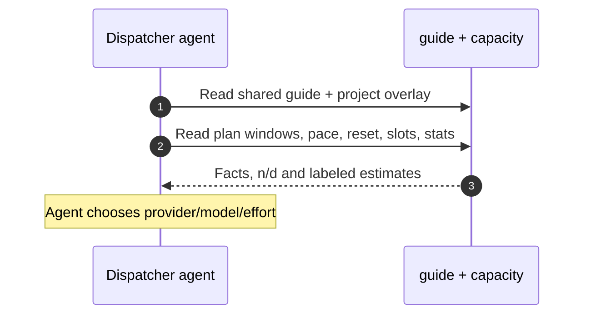
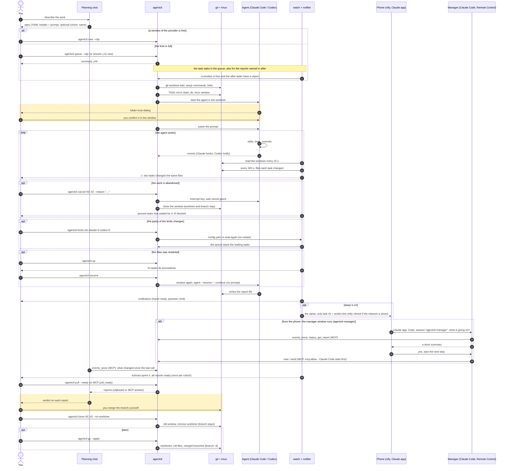
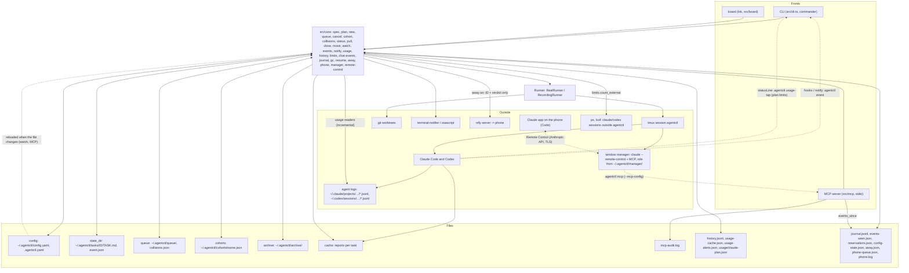
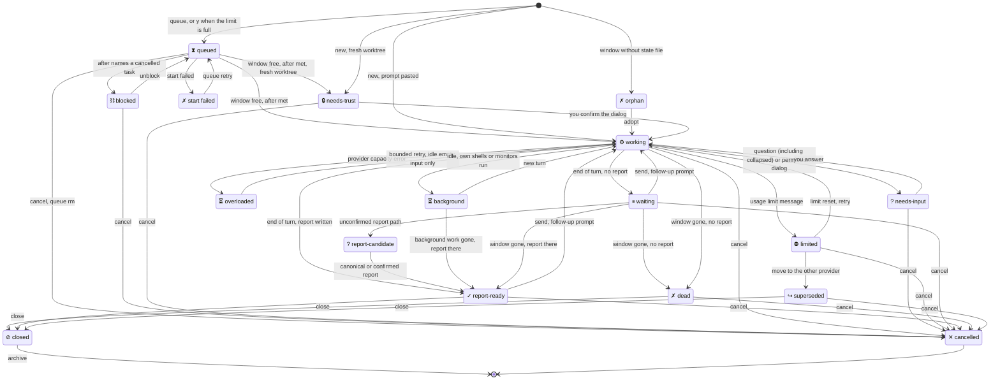

# Diagrams

Generated from README.md by `npm run docs`.

## Dispatcher

```mermaid
sequenceDiagram
    autonumber
    participant D as Dispatcher agent
    participant F as guide + capacity
    D->>F: Read shared guide + project overlay
    D->>F: Read plan windows, pace, reset, slots, stats
    F-->>D: Facts, n/d and labeled estimates
    Note over D: Agent chooses provider/model/effort
```

## Flow

```mermaid
sequenceDiagram
    autonumber
    actor H as You
    participant C as Planning chat
    participant A as agentctl
    participant G as git + tmux
    participant X as Agent (Claude Code / Codex)
    participant W as watch + notifier
    participant P as Phone (ntfy, Claude app)
    participant M as Manager (Claude Code, Remote Control)

    H->>C: describe the work
    C-->>H: spec (YAML header + prompt, optional cohort: name)
    alt a window of the provider is free
        H->>A: agentctl new --clip
    else the limit is full
        H->>A: agentctl queue --clip (or answer y to new)
        A-->>H: summary, y/N
        Note over A,W: the task waits in the queue, also for the reports named in after
        W->>A: a window is free and the after tasks have a report
    end
    A->>G: git worktree add, setup commands, links
    A->>G: TASK.md in state_dir, tmux window
    A->>X: start the agent in the worktree
    rect rgb(255, 244, 200)
    X-->>H: folder-trust dialog
    H->>X: you confirm it in the window
    end
    A->>X: paste the prompt
    loop the agent works
        X->>X: edits, tests, commits
        X-->>A: events (Claude hooks, Codex notify)
        W->>G: read the windows every 15 s
        W->>G: every 300 s: files each task changed
        W-->>H: ⚠ two tasks changed the same files
    end
    opt the work is abandoned
        H->>A: agentctl cancel NC-42 --reason "…"
        A->>X: interrupt key, wait cancel.grace
        A->>G: close the window (worktree and branch stay)
        W-->>H: queued tasks that waited for it: ⛓ blocked
    end
    opt the parity of the limits changes
        H->>A: agentctl limits set claude=3 codex=5
        A->>W: config.yaml is read again (no restart)
        W->>A: the queue starts the waiting tasks
    end
    opt the Mac was restarted
        H->>A: agentctl up
        W-->>H: N zadań do wznowienia
        H->>A: agentctl resume
        A->>X: window again, agent --resume / --continue (no prompt)
    end
    X->>G: writes the report file
    W-->>H: notification (report ready, question, limit)
    opt away is on
        W-->>P: the same, only task ID + verdict line (ntfy, retried if the network is down)
    end
    opt from the phone: the manager window runs (agentctl manager)
        P->>M: Claude app, Code, session "agentctl manager": what is going on?
        M->>A: events_since, status, get_report (MCP)
        M-->>P: a short summary
        P->>M: yes, start the next step
        M->>A: new / send (MCP, mcp.allow - Claude Code asks first)
    end
    C->>A: events_since (MCP): what changed since the last call
    W-->>H: kohorta sprint-1: all reports ready (once per cohort)
    H->>A: agentctl pull --ready (or MCP pull_ready)
    A-->>C: reports (clipboard or MCP answer)
    rect rgb(255, 244, 200)
    C-->>H: verdict on each report
    H->>G: you merge the branch yourself
    end
    H->>A: agentctl close NC-42 --rm-worktree
    A->>G: kill window, remove worktree (branch stays)
    opt later
        H->>A: agentctl gc --apply
        A->>G: worktrees, old files, merged branches (branch -d)
    end
```

## Architecture

```mermaid
flowchart TB
    subgraph fronts [Fronts]
        CLI["CLI (src/cli.ts, commander)"]
        BOARD["board (Ink, src/board)"]
        MCP["MCP server (src/mcp, stdio)"]
    end
    CORE["src/core: spec, plan, new, queue, cancel, cohort, collisions, status, pull, close, move, watch, events, notify, usage, history, limits, chat-events, journal, gc, resume, away, phone, manager, remote-control"]
    RUN["Runner: RealRunner / RecordingRunner"]
    subgraph world [Outside]
        TMUX[tmux session agentctl]
        GIT[git worktrees]
        AG[Claude Code and Codex]
        NOTE[terminal-notifier / osascript]
        PHONE["ntfy server -> phone"]
        MGR["window manager: claude --remote-control + MCP, role from ~/.agentctl/manager/"]
        APP["Claude app on the phone (Code)"]
        LOGS["agent logs: ~/.claude/projects/…/*.jsonl, ~/.codex/sessions/…/*.jsonl"]
        PS["ps, lsof: claude/codex sessions outside agentctl"]
    end
    subgraph disk [Files]
        CFG["config: ~/.agentctl/config.yaml, .agentctl.yaml"]
        STATE["state_dir: ~/.agentctl/tasks/ID/TASK.md, event.json"]
        QUEUE["queue: ~/.agentctl/queue/, collisions.json"]
        COH["cohorts: ~/.agentctl/cohorts/name.json"]
        ARCH["archive: ~/.agentctl/archive/"]
        REP["cache: reports per task"]
        AUDIT["mcp-audit.log"]
        HIST["history.jsonl, usage-cache.json, usage-alerts.json, usage/claude-plan.json"]
        JOURNAL["journal.jsonl, events-seen.json, reservations.json, config-state.json, away.json, phone-queue.json, phone.log"]
    end
    CLI --> CORE
    BOARD --> CORE
    MCP --> CORE
    CORE --> RUN
    RUN --> TMUX
    RUN --> GIT
    TMUX --> AG
    AG -. "hooks / notify: agentctl event" .-> CLI
    AG -. "statusLine: agentctl usage-tap (plan limits)" .-> CLI
    AG --> LOGS
    CORE -- "usage readers (incremental)" --> LOGS
    CORE <--> HIST
    CORE <--> JOURNAL
    CORE -- "limits.count_external" --> PS
    CORE --> NOTE
    CORE -- "away on: ID + verdict only" --> PHONE
    TMUX --> MGR
    MGR -. "agentctl mcp (--mcp-config)" .-> MCP
    APP <-. "Remote Control (Anthropic API, TLS)" .-> MGR
    CORE <--> STATE
    CORE <--> QUEUE
    CORE <--> COH
    CORE --> ARCH
    CORE --> CFG
    CFG -. "reloaded when the file changes (watch, MCP)" .-> CORE
    AG --> REP
    CORE --> REP
    MCP --> AUDIT
    MCP -- "events_since" --> JOURNAL
```

## Task states

```mermaid
stateDiagram-v2
    state "🔒 needs-trust" as trust
    state "⚙ working" as working
    state "⏳ background" as background
    state "⏸ waiting" as waiting
    state "? needs-input" as input
    state "⏳ overloaded" as overloaded
    state "? report-candidate" as candidate
    state "⛔ limited" as limited
    state "✓ report-ready" as ready
    state "↪ superseded" as superseded
    state "✗ dead" as dead
    state "✗ orphan" as orphan
    state "⊘ closed" as closed
    state "⧗ queued" as queued
    state "✗ start failed" as startfailed
    state "✕ cancelled" as cancelled
    state "⛓ blocked" as blocked

    [*] --> queued: queue, or y when the limit is full
    queued --> trust: window free, after met, fresh worktree
    queued --> working: window free, after met
    queued --> startfailed: start failed
    startfailed --> queued: queue retry
    queued --> cancelled: cancel, queue rm
    queued --> blocked: after names a cancelled task
    blocked --> queued: unblock
    blocked --> cancelled: cancel
    [*] --> trust: new, fresh worktree
    [*] --> working: new, prompt pasted
    [*] --> orphan: window without state file
    orphan --> working: adopt
    trust --> working: you confirm the dialog
    working --> waiting: end of turn, no report
    working --> ready: end of turn, report written
    working --> input: question (including collapsed) or permission dialog
    input --> working: you answer
    working --> overloaded: provider capacity error
    overloaded --> working: bounded retry, idle empty input only
    waiting --> candidate: unconfirmed report path
    candidate --> ready: canonical or confirmed report
    working --> limited: usage limit message
    limited --> working: limit reset, retry
    limited --> superseded: move to the other provider
    working --> background: idle, own shells or monitors run
    background --> working: new turn
    background --> ready: background work gone, report there
    waiting --> working: send, follow-up prompt
    ready --> working: send, follow-up prompt
    waiting --> dead: window gone, no report
    working --> dead: window gone, no report
    waiting --> ready: window gone, report there
    dead --> closed: close
    ready --> closed: close
    superseded --> closed: close
    closed --> [*]: archive
    trust --> cancelled: cancel
    working --> cancelled: cancel
    input --> cancelled: cancel
    limited --> cancelled: cancel
    waiting --> cancelled: cancel
    ready --> cancelled: cancel
    dead --> cancelled: cancel
    superseded --> cancelled: cancel
    cancelled --> [*]
```
